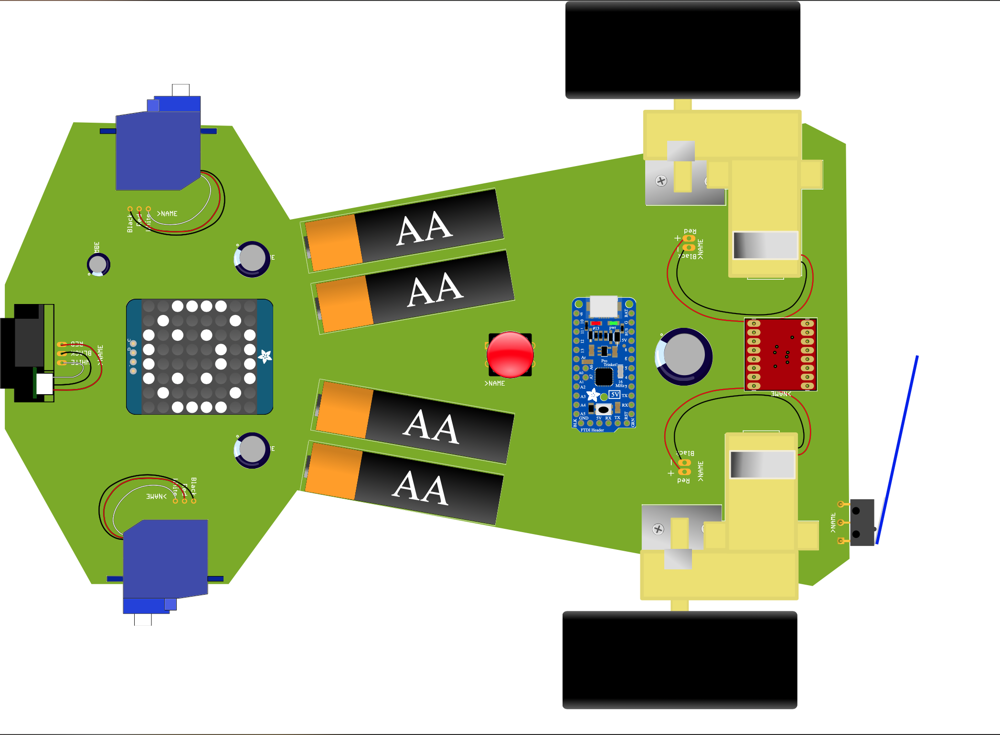
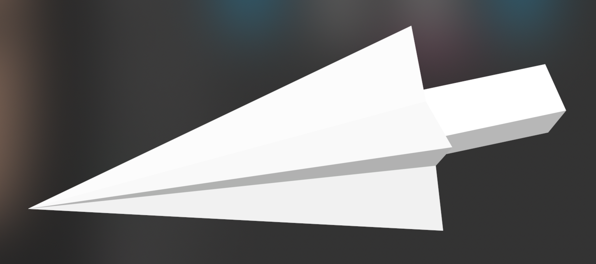
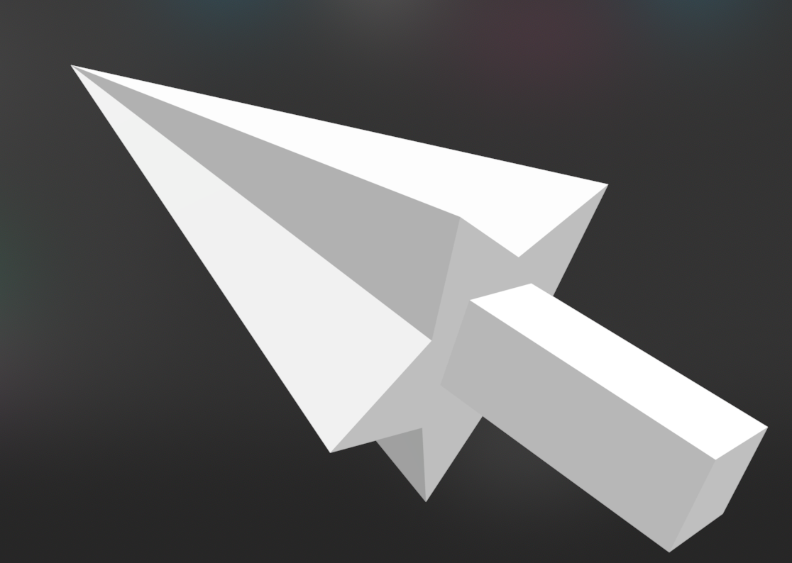

# self-driving-robot-car: Demon Slayer :)
- Course: ***CSE 42***. Building and Programming Electronic Devices 
- The assembly instructions can be found in the ***"Demon-Slayer-assembly.html"*** file.
- Code can be found in the ***"Demon-Slayer-Test-Program"*** folder.

## Contributors
| Main Author  | Main Author |
| ------------- | ------------- |
| Benny Cai  | Rui Cai  |

**Goal**: The robot car is able to 
- "**sweep enemies**" with its arms when it senses a car within 10cm in front it.
- **accelerate** when another car hits the bump at the back of it.
- **make a turn** after sweeping other cars

**Main Components**: an Arduino microcontroller, two micro-servos, robot car's parts, a bump switch, an analog distance sensor  

  

**Highlight**: 3D printed arms/weapons!
- the weapons are attached on the two servos
- attack when the servos rotate

